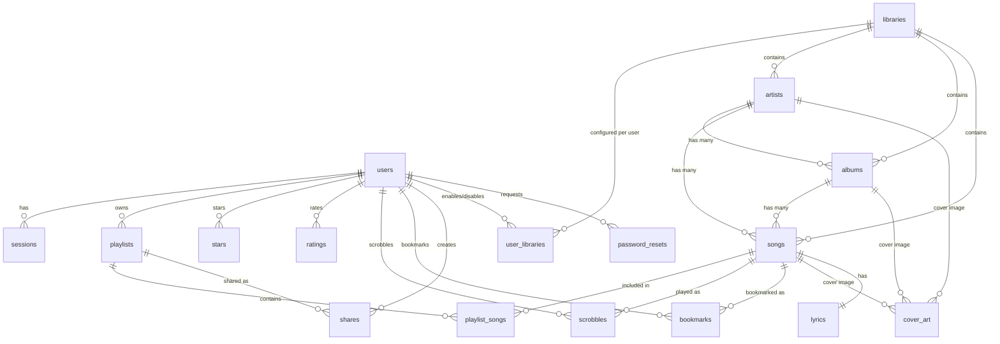

# 数据库设计

## 概述

- **数据库**: SQLite 3（通过 SeaORM 2.0 + sqlx-sqlite 访问）
- **时间戳**: 统一使用 13 位 Unix 毫秒时间戳（`i64`），与 API 响应保持一致
- **主键**: 统一使用 `INTEGER PRIMARY KEY AUTOINCREMENT`
- **布尔值**: SQLite 无原生布尔类型，使用 `INTEGER`（0/1）存储
- **JSON**: 权限等灵活结构使用 `TEXT` 存储 JSON 字符串

---

## ER 图

---

## 表定义

### 1. `users` — 用户

用户账户与个人设置。

| 列 | 类型 | 约束 | 说明 |
|---|------|------|------|
| `id` | INTEGER | PK, AUTOINCREMENT | 用户 ID |
| `username` | TEXT | UNIQUE, NOT NULL | 用户名 |
| `password_hash` | TEXT | NOT NULL | 密码哈希（argon2 / bcrypt） |
| `email` | TEXT | | 邮箱地址 |
| `privs` | TEXT | NOT NULL, DEFAULT '{}' | 权限 JSON 对象，如 `{"edit_user": true, "edit_library": true}` |
| `scrobbling_enabled` | INTEGER | NOT NULL, DEFAULT 1 | 是否启用播放记录 |
| `max_bit_rate` | INTEGER | NOT NULL, DEFAULT 0 | 最大码率限制（kbps），0 = 无限制 |
| `is_enabled` | INTEGER | NOT NULL, DEFAULT 1 | 账户启用状态（禁用后无法登录） |
| `created_at` | INTEGER | NOT NULL | 创建时间（13 位毫秒时间戳） |
| `updated_at` | INTEGER | NOT NULL | 最后更新时间 |

**索引**:
- `idx_users_username` UNIQUE on `username`

> 现有 `users` 表仅含 `id`、`username`、`created_at`，需通过 migration 扩展上述字段。

---

### 2. `libraries` — 音乐库

音乐库（文件夹）的全局配置。

| 列 | 类型 | 约束 | 说明 |
|---|------|------|------|
| `id` | INTEGER | PK, AUTOINCREMENT | 音乐库 ID |
| `name` | TEXT | NOT NULL | 显示名称 |
| `path` | TEXT | UNIQUE, NOT NULL | 文件系统绝对路径 |
| `is_enabled` | INTEGER | NOT NULL, DEFAULT 1 | 全局启用状态 |
| `watch_enabled` | INTEGER | NOT NULL, DEFAULT 0 | 是否启用文件监听（notify） |
| `created_at` | INTEGER | NOT NULL | 创建时间 |

---

### 3. `user_libraries` — 用户音乐库偏好

每位用户对各个音乐库的启用/禁用状态（个人设置，区别于 `libraries.is_enabled` 的全局设置）。

| 列 | 类型 | 约束 | 说明 |
|---|------|------|------|
| `user_id` | INTEGER | PK, FK → users(id) ON DELETE CASCADE | 用户 ID |
| `library_id` | INTEGER | PK, FK → libraries(id) ON DELETE CASCADE | 音乐库 ID |
| `is_enabled` | INTEGER | NOT NULL, DEFAULT 1 | 用户是否启用此库 |

---

### 4. `artists` — 艺术家

| 列 | 类型 | 约束 | 说明 |
|---|------|------|------|
| `id` | INTEGER | PK, AUTOINCREMENT | 艺术家 ID |
| `name` | TEXT | NOT NULL | 艺术家名称 |
| `sort_name` | TEXT | | 排序用名称（如去除 "The" 前缀） |
| `library_id` | INTEGER | FK → libraries(id) ON DELETE CASCADE | 所属音乐库 |
| `created_at` | INTEGER | NOT NULL | 添加时间 |

**索引**:
- `idx_artists_name` on `name`
- `idx_artists_sort_name` on `sort_name`
- `idx_artists_library_id` on `library_id`

---

### 5. `albums` — 专辑

| 列 | 类型 | 约束 | 说明 |
|---|------|------|------|
| `id` | INTEGER | PK, AUTOINCREMENT | 专辑 ID |
| `name` | TEXT | NOT NULL | 专辑名称 |
| `artist_id` | INTEGER | NOT NULL, FK → artists(id) ON DELETE CASCADE | 艺术家 ID |
| `year` | INTEGER | | 发行年份 |
| `library_id` | INTEGER | FK → libraries(id) ON DELETE CASCADE | 所属音乐库 |
| `created_at` | INTEGER | NOT NULL | 添加时间 |

**索引**:
- `idx_albums_name` on `name`
- `idx_albums_artist_id` on `artist_id`
- `idx_albums_year` on `year`
- `idx_albums_library_id` on `library_id`

---

### 6. `songs` — 歌曲

| 列 | 类型 | 约束 | 说明 |
|---|------|------|------|
| `id` | INTEGER | PK, AUTOINCREMENT | 歌曲 ID |
| `title` | TEXT | NOT NULL | 歌曲标题 |
| `artist_id` | INTEGER | NOT NULL, FK → artists(id) ON DELETE CASCADE | 艺术家 ID |
| `album_id` | INTEGER | FK → albums(id) ON DELETE SET NULL | 专辑 ID（可为空） |
| `track_number` | INTEGER | | 音轨号 |
| `disc_number` | INTEGER | | 碟号 |
| `duration_secs` | INTEGER | NOT NULL | 时长（秒） |
| `bit_rate` | INTEGER | | 比特率（kbps） |
| `size_bytes` | INTEGER | | 文件大小（字节） |
| `file_format` | TEXT | | 文件格式（如 `mp3`、`flac`） |
| `content_type` | TEXT | | MIME 类型（如 `audio/mpeg`） |
| `year` | INTEGER | | 年份（冗余字段，方便查询） |
| `file_path` | TEXT | NOT NULL | 音频文件在文件系统中的绝对路径 |
| `has_cover_art` | INTEGER | NOT NULL, DEFAULT 0 | 是否有内嵌封面 |
| `library_id` | INTEGER | NOT NULL, FK → libraries(id) ON DELETE CASCADE | 所属音乐库 |
| `created_at` | INTEGER | NOT NULL | 添加时间 |

**索引**:
- `idx_songs_title` on `title`
- `idx_songs_artist_id` on `artist_id`
- `idx_songs_album_id` on `album_id`
- `idx_songs_year` on `year`
- `idx_songs_library_id` on `library_id`
- `idx_songs_file_path` UNIQUE on `file_path`（防止重复导入）
- `idx_songs_created_at` on `created_at`

---

### 7. `playlists` — 歌单

| 列 | 类型 | 约束 | 说明 |
|---|------|------|------|
| `id` | INTEGER | PK, AUTOINCREMENT | 歌单 ID |
| `name` | TEXT | NOT NULL | 名称 |
| `owner_id` | INTEGER | NOT NULL, FK → users(id) ON DELETE CASCADE | 创建者 |
| `comment` | TEXT | | 备注 / 描述 |
| `is_public` | INTEGER | NOT NULL, DEFAULT 0 | 是否公开 |
| `created_at` | INTEGER | NOT NULL | 创建时间 |
| `updated_at` | INTEGER | NOT NULL | 最后更新时间 |

**索引**:
- `idx_playlists_owner_id` on `owner_id`

---

### 8. `playlist_songs` — 歌单歌曲

| 列 | 类型 | 约束 | 说明 |
|---|------|------|------|
| `playlist_id` | INTEGER | PK, FK → playlists(id) ON DELETE CASCADE | 歌单 ID |
| `song_id` | INTEGER | PK, FK → songs(id) ON DELETE CASCADE | 歌曲 ID |
| `position` | INTEGER | NOT NULL | 在歌单中的序号（从 1 开始） |
| `added_at` | INTEGER | NOT NULL | 添加时间 |

**复合主键**: `(playlist_id, song_id)`

---

### 9. `stars` — 收藏

| 列 | 类型 | 约束 | 说明 |
|---|------|------|------|
| `user_id` | INTEGER | PK, FK → users(id) ON DELETE CASCADE | 用户 ID |
| `item_type` | TEXT | PK, NOT NULL | 类型：`song`、`album`、`artist` |
| `item_id` | INTEGER | PK, NOT NULL | 对应类型的 ID |
| `starred_at` | INTEGER | NOT NULL | 收藏时间 |

**复合主键**: `(user_id, item_type, item_id)`

**索引**:
- `idx_stars_user_id` on `user_id`
- `idx_stars_item` on `(item_type, item_id)`

> `item_type` + `item_id` 构成多态关联，指向 `songs`、`albums` 或 `artists` 表。

---

### 10. `ratings` — 评分

| 列 | 类型 | 约束 | 说明 |
|---|------|------|------|
| `user_id` | INTEGER | PK, FK → users(id) ON DELETE CASCADE | 用户 ID |
| `item_type` | TEXT | PK, NOT NULL | 类型：`song`、`album` |
| `item_id` | INTEGER | PK, NOT NULL | 对应类型的 ID |
| `rating` | INTEGER | NOT NULL, CHECK(1-5) | 评分（1-5） |
| `rated_at` | INTEGER | NOT NULL | 评分时间 |

**复合主键**: `(user_id, item_type, item_id)`

---

### 11. `scrobbles` — 播放记录

| 列 | 类型 | 约束 | 说明 |
|---|------|------|------|
| `id` | INTEGER | PK, AUTOINCREMENT | 记录 ID |
| `user_id` | INTEGER | NOT NULL, FK → users(id) ON DELETE CASCADE | 用户 ID |
| `song_id` | INTEGER | NOT NULL, FK → songs(id) ON DELETE CASCADE | 歌曲 ID |
| `submission` | INTEGER | NOT NULL, DEFAULT 1 | `1` = 正式 scrobble（已听完），`0` = 正在播放 |
| `played_at` | INTEGER | NOT NULL | 播放时间 |

**索引**:
- `idx_scrobbles_user_song_time` on `(user_id, song_id, played_at)`（用于去重）
- `idx_scrobbles_user_played` on `(user_id, played_at DESC)`（播放历史查询）
- `idx_scrobbles_song_id` on `song_id`

> **去重**: 同一用户对同一歌曲在短时间窗口内的重复 scrobble 由应用层处理。
>
> **播放完成判定**: `submission=1` 时，播放时长须超过歌曲总时长的一半或 4 分钟（取两者中较短者）。

---

### 12. `bookmarks` — 播放书签

| 列 | 类型 | 约束 | 说明 |
|---|------|------|------|
| `id` | INTEGER | PK, AUTOINCREMENT | 书签 ID |
| `user_id` | INTEGER | NOT NULL, FK → users(id) ON DELETE CASCADE | 用户 ID |
| `song_id` | INTEGER | NOT NULL, FK → songs(id) ON DELETE CASCADE | 歌曲 ID |
| `position_ms` | INTEGER | NOT NULL | 播放位置（毫秒） |
| `device_id` | TEXT | | 设备标识 |
| `updated_at` | INTEGER | NOT NULL | 最后更新时间 |

**唯一约束**: `(user_id, song_id, device_id)` — 同一用户在同一设备上对同一歌曲只能有一个书签。

> `device_id` 为 NULL 时视为默认设备，`(user_id, song_id, NULL)` 也受唯一约束保护（SQLite 中 NULL 值视为不同，需应用层处理）。

---

### 13. `shares` — 分享链接

| 列 | 类型 | 约束 | 说明 |
|---|------|------|------|
| `id` | INTEGER | PK, AUTOINCREMENT | 分享 ID |
| `owner_id` | INTEGER | NOT NULL, FK → users(id) ON DELETE CASCADE | 创建者 |
| `item_type` | TEXT | NOT NULL | 类型：`song`、`album`、`playlist` |
| `item_id` | INTEGER | NOT NULL | 分享内容的 ID |
| `description` | TEXT | | 描述文字 |
| `token` | TEXT | UNIQUE, NOT NULL | 分享令牌（随机字符串） |
| `visit_count` | INTEGER | NOT NULL, DEFAULT 0 | 访问次数 |
| `last_visited_at` | INTEGER | | 最近访问时间 |
| `expires_at` | INTEGER | | 过期时间（NULL = 永不过期） |
| `created_at` | INTEGER | NOT NULL | 创建时间 |

**索引**:
- `idx_shares_token` UNIQUE on `token`
- `idx_shares_owner_id` on `owner_id`

---

### 14. `sessions` — 用户会话

| 列 | 类型 | 约束 | 说明 |
|---|------|------|------|
| `id` | TEXT | PK | 会话 ID（随机字符串，如 `sess_abc123`） |
| `user_id` | INTEGER | NOT NULL, FK → users(id) ON DELETE CASCADE | 用户 ID |
| `token` | TEXT | UNIQUE, NOT NULL | Bearer 令牌 |
| `device_info` | TEXT | | 设备 / 客户端信息 |
| `created_at` | INTEGER | NOT NULL | 创建时间 |
| `last_used_at` | INTEGER | NOT NULL | 最近使用时间 |
| `expires_at` | INTEGER | NOT NULL | 过期时间 |

**索引**:
- `idx_sessions_token` UNIQUE on `token`
- `idx_sessions_user_id` on `user_id`

---

### 15. `password_resets` — 密码重置

| 列 | 类型 | 约束 | 说明 |
|---|------|------|------|
| `id` | INTEGER | PK, AUTOINCREMENT | 记录 ID |
| `email` | TEXT | NOT NULL | 邮箱地址 |
| `code` | TEXT | NOT NULL | 验证码 |
| `expires_at` | INTEGER | NOT NULL | 过期时间 |
| `used` | INTEGER | NOT NULL, DEFAULT 0 | 是否已使用 |
| `created_at` | INTEGER | NOT NULL | 创建时间 |

**索引**:
- `idx_password_resets_email` on `email`

---

### 16. `scan_tasks` — 扫描任务

| 列 | 类型 | 约束 | 说明 |
|---|------|------|------|
| `id` | TEXT | PK | 扫描任务 ID（如 `scan_abc123`） |
| `status` | TEXT | NOT NULL | 状态：`scanning`、`completed`、`failed`、`cancelled` |
| `files_scanned` | INTEGER | NOT NULL, DEFAULT 0 | 已扫描文件数 |
| `files_total` | INTEGER | NOT NULL, DEFAULT 0 | 总文件数（估算） |
| `started_at` | INTEGER | NOT NULL | 开始时间 |
| `finished_at` | INTEGER | | 完成时间 |
| `error` | TEXT | | 错误信息（仅 `failed` 状态） |

> `library_ids` 可通过单独的关联表或在内存中维护（扫描是临时任务，非持久化数据的主表）。

---

### 17. `lyrics` — 歌词

| 列 | 类型 | 约束 | 说明 |
|---|------|------|------|
| `song_id` | INTEGER | PK, FK → songs(id) ON DELETE CASCADE | 歌曲 ID |
| `type` | TEXT | NOT NULL | 类型：`synced`（LRC）、`unsynced`（纯文本） |
| `content` | TEXT | NOT NULL | 歌词全文 |

---

### 18. `cover_art` — 封面缓存

| 列 | 类型 | 约束 | 说明 |
|---|------|------|------|
| `id` | INTEGER | PK, AUTOINCREMENT | ID |
| `item_type` | TEXT | NOT NULL | 类型：`song`、`album`、`artist` |
| `item_id` | INTEGER | NOT NULL | 对应类型的 ID |
| `mime_type` | TEXT | NOT NULL | MIME 类型（如 `image/jpeg`） |
| `width` | INTEGER | | 原始宽度 |
| `height` | INTEGER | | 原始高度 |
| `file_path` | TEXT | | 缓存文件路径（NULL 表示从媒体文件内嵌提取） |

**唯一约束**: `(item_type, item_id)`

---

## 聚合字段说明

以下 API 响应字段不存储在数据库中，由查询实时计算：

| 字段 | 计算方式 |
|------|---------|
| `song_count`（艺术家/专辑/歌单/音乐库） | `COUNT(songs WHERE …)` |
| `album_count`（艺术家） | `COUNT(albums WHERE artist_id = …)` |
| `duration_secs`（专辑/歌单） | `SUM(songs.duration_secs)` |
| `play_count`（歌曲/专辑/艺术家） | `COUNT(scrobbles WHERE … AND submission = 1)` |
| `starred`（歌曲/专辑/艺术家，当前用户） | `stars.starred_at WHERE user_id = … AND item_type = … AND item_id = …` |
| `rating`（歌曲/专辑，当前用户） | `ratings.rating WHERE user_id = … AND item_type = … AND item_id = …` |

---

## 级联删除策略

| 父表 | 子表 | 策略 |
|------|------|------|
| `users` | `playlists`, `stars`, `ratings`, `scrobbles`, `bookmarks`, `shares`, `sessions`, `user_libraries` | CASCADE |
| `libraries` | `artists`, `albums`, `songs`, `user_libraries` | CASCADE |
| `artists` | `albums`, `songs` | CASCADE |
| `albums` | `songs` | SET NULL（保留歌曲，album_id 置空） |
| `songs` | `playlist_songs`, `scrobbles`, `bookmarks`, `lyrics` | CASCADE |
| `playlists` | `playlist_songs`, `shares` | CASCADE |

> 删除音乐库（`libraries`）时级联删除其下所有艺术家、专辑、歌曲及关联数据，API 响应中返回删除计数。
