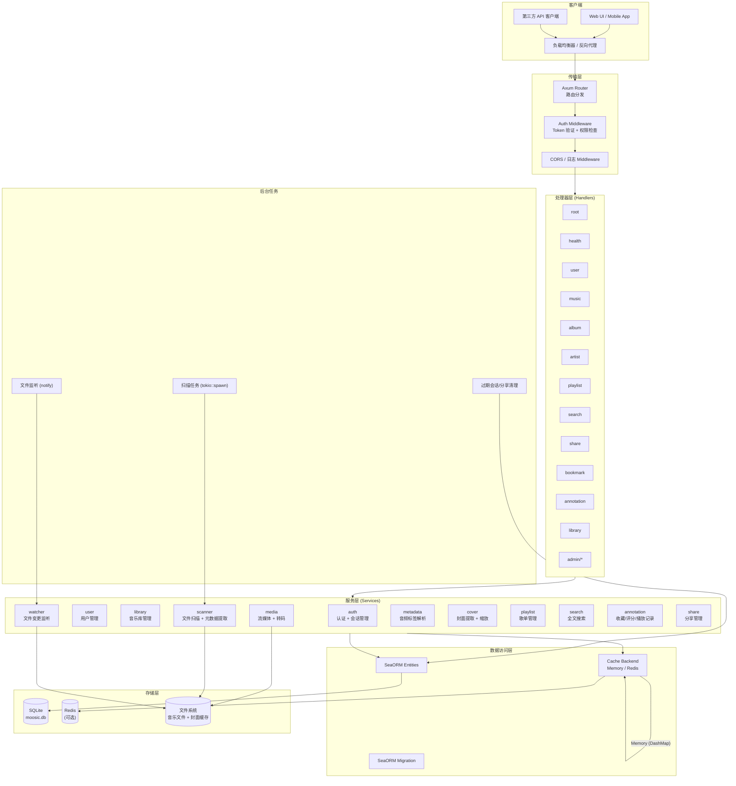
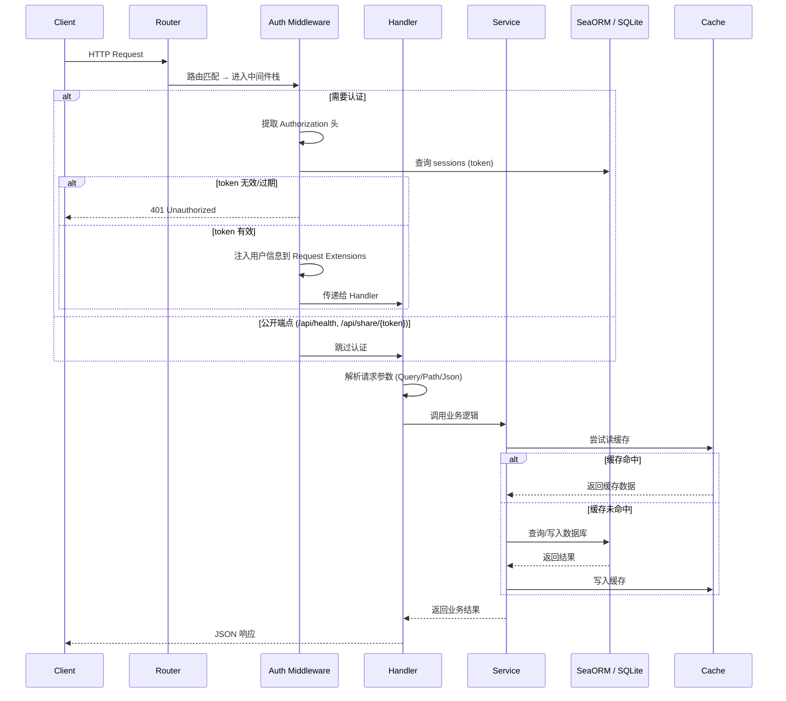
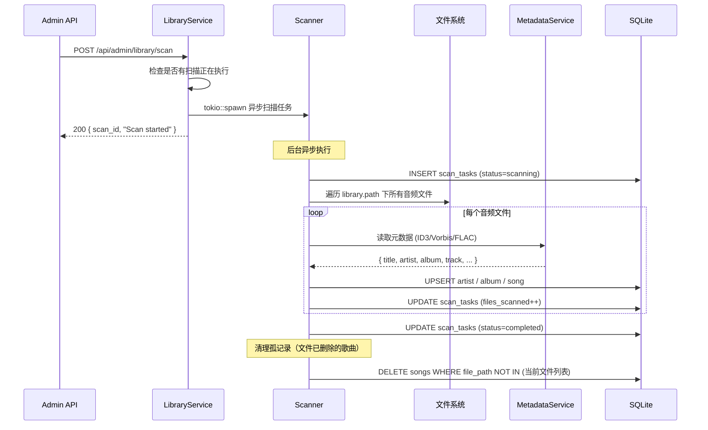
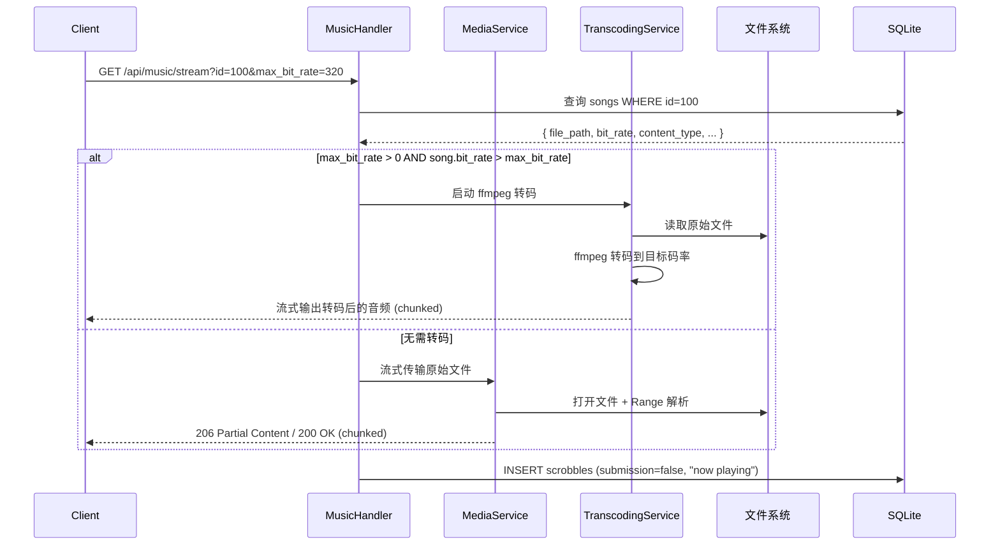
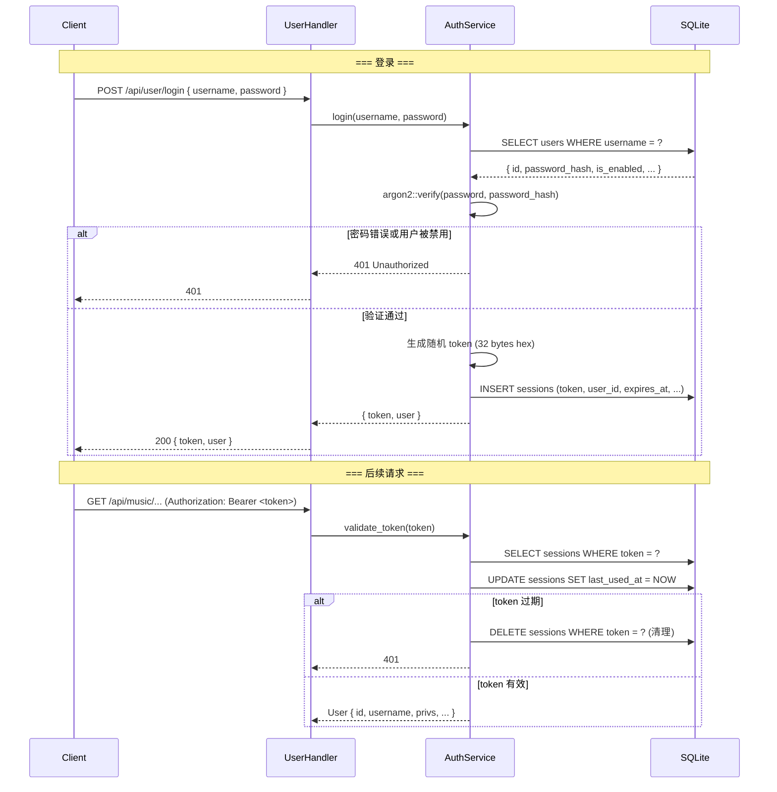
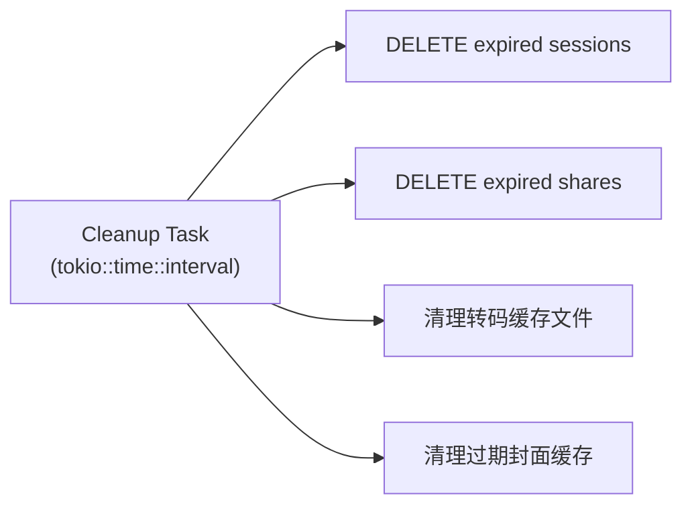
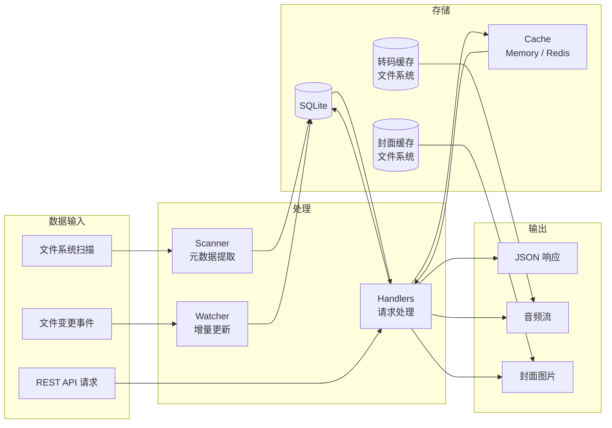

# 概览

## 概述

Moosic 是一款自托管音乐服务器，使用 Rust 语言构建。

---

## 分层架构



---

## 模块结构

```
moosic/
├── src/
│   ├── main.rs                     # 入口：初始化 tracing、config、db、cache、router
│   ├── config.rs                   # 配置加载（JSON → Config struct）
│   ├── state.rs                    # AppState（共享状态）
│   ├── router.rs                   # 路由注册 + State 注入
│   │
│   ├── middleware/
│   │   ├── mod.rs
│   │   └── auth.rs                 # Token 验证中间件 + 权限检查
│   │
│   ├── entities/                   # SeaORM 实体（数据库表映射）
│   │   ├── mod.rs                  # 注册所有实体
│   │   ├── prelude.rs              # 便捷 re-export
│   │   ├── users.rs
│   │   ├── libraries.rs
│   │   ├── user_libraries.rs
│   │   ├── artists.rs
│   │   ├── albums.rs
│   │   ├── songs.rs
│   │   ├── playlists.rs
│   │   ├── playlist_songs.rs
│   │   ├── stars.rs
│   │   ├── ratings.rs
│   │   ├── scrobbles.rs
│   │   ├── bookmarks.rs
│   │   ├── shares.rs
│   │   ├── sessions.rs
│   │   ├── scan_tasks.rs
│   │   ├── lyrics.rs
│   │   └── cover_art.rs
│   │
│   ├── handlers/                   # HTTP 请求处理器（Controller 层）
│   │   ├── mod.rs                  # 模块声明 + 公共 re-export
│   │   ├── root.rs                 # GET /
│   │   ├── health.rs              # GET /api/health
│   │   ├── user.rs                # /api/user/*
│   │   ├── music.rs               # /api/music/*
│   │   ├── album.rs               # /api/album/*
│   │   ├── artist.rs              # /api/artist/*
│   │   ├── playlist.rs            # /api/playlist/*
│   │   ├── search.rs              # /api/search/*
│   │   ├── share.rs               # /api/share/*
│   │   ├── bookmark.rs            # /api/bookmark/*
│   │   ├── annotation.rs          # /api/annotation/*
│   │   ├── library.rs             # /api/library/*
│   │   └── admin/
│   │       ├── mod.rs
│   │       ├── user.rs            # /api/admin/user/*
│   │       ├── library.rs         # /api/admin/library/*
│   │       └── server.rs          # /api/admin/server/status
│   │
│   ├── services/                   # 业务逻辑层
│   │   ├── mod.rs
│   │   ├── auth.rs                # 登录/登出/token 管理/权限
│   │   ├── user.rs                # 用户 CRUD + 自服务
│   │   ├── library.rs             # 音乐库 CRUD + 配置
│   │   ├── scanner.rs             # 文件系统扫描 + 变更检测
│   │   ├── watcher.rs             # notify 文件监听服务, 用于监听所有音乐库目录下的文件变更, 若有音乐文件发生变更则进行更新
│   │   ├── media.rs               # 流媒体传输 + Range 支持
│   │   ├── transcoding.rs         # ffmpeg 转码子进程管理
│   │   ├── metadata.rs            # 音频元数据读取（ID3/Vorbis/FLAC）
│   │   ├── cover.rs               # 封面提取 + 缩放缓存
│   │   ├── playlist.rs            # 歌单 CRUD + 排序
│   │   ├── search.rs              # 全文搜索 + 建议
│   │   ├── annotation.rs          # 收藏/评分/scrobble
│   │   └── share.rs               # 分享链接管理
│   │
│   ├── db/
│   │   ├── mod.rs                  # 数据库连接 + 迁移执行
│   │   └── sqlite.rs               # SQLite 连接实现
│   │
│   └── cache/
│       ├── mod.rs                  # CacheBackend 枚举
│       ├── memory.rs               # DashMap 内存缓存
│       └── redis.rs                # Redis 缓存
│
├── migration/                      # SeaORM 迁移 crate
│   ├── Cargo.toml
│   └── src/
│       ├── lib.rs                  # Migrator 入口
│       ├── main.rs                 # 独立 CLI 运行迁移
│       └── m*.rs                   # 各版本迁移文件
│
├── config.json                     # 运行时配置
├── Cargo.toml                      # Workspace 根 + 主 crate 依赖
└── docs/
    ├── api/                        # API 文档
    ├── db/                         # 数据库设计文档
    └── design/                     # 架构设计文档
```

---

## 核心流程

### 1. 请求处理流程



### 2. 音乐库扫描流程



**增量扫描**: 比较文件的 `mtime` 与数据库中 `songs.updated_at`，仅重新扫描变更过的文件。

**扫描策略**: 同 Navidrome，采用 Quick Scan（基于 mtime + size）→ Full Scan（重新读取标签）的两阶段策略。Quick Scan 快速发现新增/删除文件，Full Scan 在标签变更时触发。

### 3. 流媒体播放流程



**Range 请求支持**: 通过解析 `Range: bytes=start-end` 请求头实现 seek 操作。使用 `tokio::fs::File` 的 `seek` + `take` 读取指定范围的字节。

**转码缓存**: 转码后的数据可按 key `transcode:{song_id}:{bit_rate}` 缓存到文件系统（`/var/cache/moosic/transcodes/`）或 Redis，避免重复转码。

### 4. 认证流程



---

## 后台任务

所有后台任务通过 `tokio::spawn` 在应用启动时创建，注册到 `AppState` 中统一管理生命周期。

```
┌─────────────────────────────────────────────────────────┐
│                      AppState                            │
│  ┌──────────────┐  ┌──────────────┐  ┌───────────────┐  │
│  │ ScannerHandle│  │ WatcherHandle│  │ CleanupHandle │  │
│  │ (JoinHandle) │  │ (JoinHandle) │  │ (JoinHandle)  │  │
│  └──────────────┘  └──────────────┘  └───────────────┘  │
│  ┌──────────────────────────────────────────────────┐   │
│  │        scan_task: Option<ScanTask>                │   │
│  │        (当前扫描状态，Arc<RwLock<...>>)            │   │
│  └──────────────────────────────────────────────────┘   │
└─────────────────────────────────────────────────────────┘
```

### 定时清理任务



---

## 数据流图



---


## 音频元数据解析库

采用 lofty 

## 转码策略

- 通过 `std::process::Command` 调用系统 `ffmpeg`
- 转码命令示例: `ffmpeg -i input.flac -ab 320k -f mp3 -`
- 输出到 stdout，通过 `tokio::process::ChildStdout` 流式读取
- 转码结果可缓存到磁盘（按 `song_id + bit_rate` 作为 key）

---

## 状态管理

```mermaid
classDiagram
    class AppState {
        +DatabaseConnection db
        +CacheBackend cache
        +String server_host
        +u16 server_port
        +Option~ScanHandle~ scanner
        +Option~WatcherHandle~ watcher
    }

    class CacheBackend {
        +kind() &'static str
        +get(key) Option~String~
        +set(key, value, ttl)
        +del(key)
        +exists(key) bool
    }

    class DatabaseConnection {
        (SeaORM 连接池)
    }

    AppState --> CacheBackend
    AppState --> DatabaseConnection
```

`AppState` 通过 `axum::extract::State` 注入到每个 Handler 中，内部的可变状态（如扫描任务进度）使用 `Arc<RwLock<T>>` 保护。

---

## 安全设计

| 领域 | 措施 |
|------|------|
| 密码存储 | argon2id 哈希（推荐参数: m=19456, t=2, p=1） |
| 密码重置 | 6 位数字验证码 + 10 分钟过期 + 防枚举（统一返回 200） |
| Token | 32 字节随机 hex 字符串，可配置过期时间 |
| 文件访问 | 流媒体/下载时验证歌曲所属 library 是否对当前用户启用 |
| CORS | 可配置允许的来源 |
| 速率限制 | 登录端点 / 密码重置端点基于 IP 限流（可选） |
| 路径遍历 | 验证 `file_path` 在 `library.path` 前缀内，防止目录穿越 |
